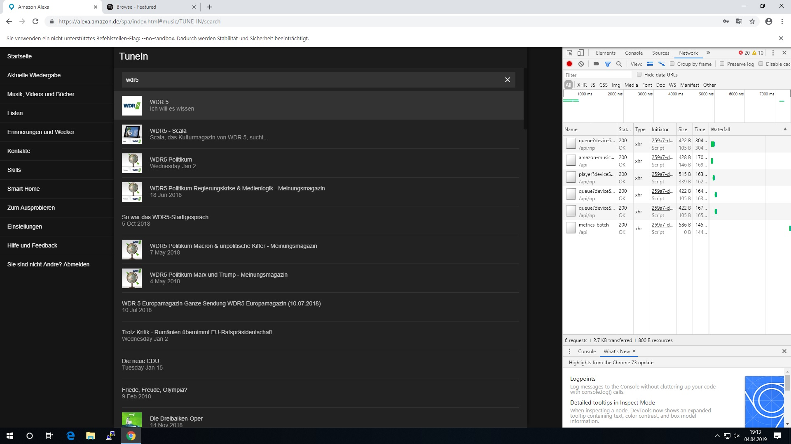
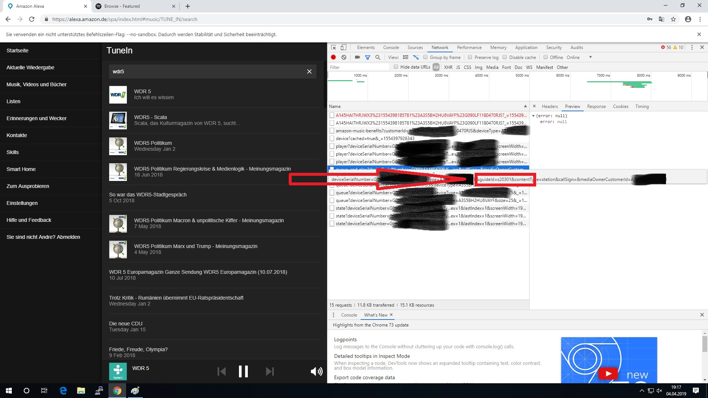
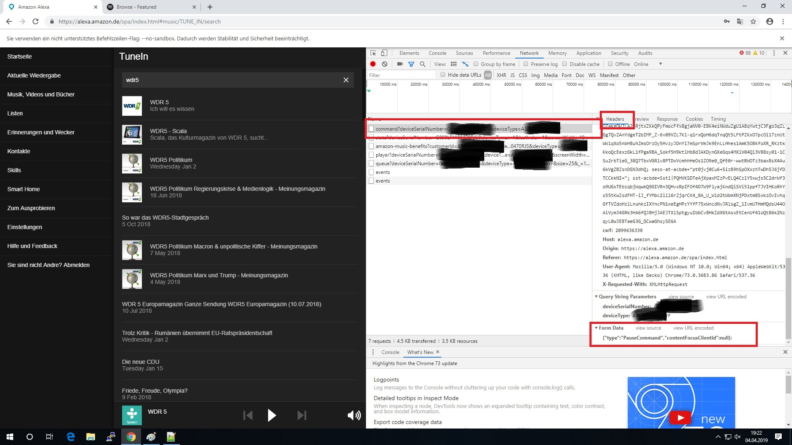

# AlexaRc4shNG

#### Version 1.0.0

The plugin gives the possibilty to control an Alexa-Echo-Device remote by smartHomeNG. So its possible to switch on an TuneIn-Radio Channel, send some messages via Text2Speech when an event happens on the knx-bus or on the Visu. On the Web-Interface you can define your own commandlets. The follwing functions are available on the Web-Interface :

- Store a cookie-file to get access to the Alexa-WebInterface
- See all available devices, select one to send Test-Functions
- define Commandlets - you can load,store,delete, check and test Commandlets
- the Commandlets can be loaded to the webinterface by clicking on the list
- the Json-Structure can be checked on the WebInterface

In the API-URL and in the json-payload you have to replace the real values from the Alexa-Webinterface with the following placeholders. For testing functions its not really neccessary to use the placeholders.

This plugin for smarthomeNG is mainly based on the informations of
[Lötzimmer](https://blog.loetzimmer.de/2017/10/amazon-alexa-hort-auf-die-shell-echo.html) ,[Apollon77](https://github.com/Apollon77/alexa-remote) and the  [openhab2](https://community.openhab.org/t/released-openhab2-amazon-echo-control-binding-controlling-alexa-from-openhab2/37844)
#### !! So many thanks for the very good research and development in the past !!

## table of content

1. [PlaceHolders](#placeholders)
2. [Change Log](#changelog)
3. [Requirements](#requirements)
4. [Configuration](#config)
4. [Web-Interface](#webinterface)
4. [How to implmentend new Commands](#newCommand)
5. [Tips for existing Command-Lets](#tipps)

### Existing Command-Lets

- Play (Plays the last paused Media)
- Pause (pauses the actual media)
- Text2Speech (sends a Text to the echo, echo will speak it)
- StartTuneInStation (starts a TuneInRadiostation with the guideID you send)

### Placeholders :<a name="placeholders"/></a>
```
<mValue>			= Value to send
<serialNumber>			= SerialNo. of the device where the command should go to
<familiy>			= device family
<deviceType>			= deviceType
<deviceOwnerCustomerId>		= OwnerID of the device
```
#### <strong>!! Please keep in mind to use the "<" and the ">" the qualify the placeholders !!</strong>

## Change Log<a name="changelog"/>


### Changes Since version 1.x.x

- no changes, first Release


## Requirements<a name="requirements"/>


### Needed software

* the plugin need pycurl (pip install pycurl)
* smarthomeNg 1.4.2 and above for the web-interface


### Supported Hardware

* all that supports smartHomeNG


## Configuration<a name="config"/>

### plugin.yaml

The plugin needs to be defined in the plugin.yaml in this way. The attributes are : <br> class_name -> fix <br> class_path -> fix (depending on you configuration) <br> cookiefile -> the path to the cookie-file. Here it will stored from the Web-Interfache<br>host -> the adress of you Alexa-WebInterface


```yaml
alexarc4shng:
    class_name: alexarc4shng
    class_path: plugins.alexarc4shng
    cookiefile: '/usr/local/smarthome/plugins/alexarc4shng/cookies.txt'
    host:       'alexa.amazon.de'
```


### items.yaml

The configuration of the item are done in the following way :
<strong><br><br>
alexa_cmd_01: Value:EchoDevice:Commandlet:Value_to_Send

Sampe to switch on a Radiostation by using TuneIN<br><br>
Value = True means the item() becomes "ON"<br>
EchodotKueche = Devicename where the Command should be send to<br>
StartTuneInStaion = Name of the Commandlet<br>
S96141 = Value of the Radiostation (here S96141 = baden.fm)

example:
alexa_cmd_01: True:EchoDotKueche:StartTuneInStation:s96141
</strong>

#### alexa_cmd_XX

You can specify up to 99 Commands per shng-item. The plugin scanns the item.conf/item.yaml during initialization for commands starting with 01 up to 99.

<strong>Please start all the time with 01, the command-numbers must be serial, dont forget one the scann of commands is stopped when there is no command found with the next number</strong>

#### Example

Example for settings in an item.yaml file :

```yaml
# items/my.yaml
%YAML 1.1
---

OG:

    Buero:
        name: Buero
        Licht:
            type: bool
            alexa_name: Licht Büro
            alexa_description: Licht Büro
            alexa_actions: TurnOn TurnOff
            alexa_icon: LIGHT
            alexa_cmd_01: True:EchoDotKueche:StartTuneInStation:s96141
            alexa_cmd_02: True:EchoDotKueche:Text2Speech:Hallo das Licht im Buero ist eingeschalten
            alexa_cmd_03: False:EchoDotKueche:Text2Speech:Hallo das Licht im Buero ist aus
            alexa_cmd_04: 'False:EchoDotKueche:Pause: '
            visu_acl: rw
            knx_dpt: 1
            knx_listen: 1/1/105
            knx_send: 1/1/105
            enforce_updates: 'true'

```
Example for settings in an item.conf file :

```yaml
# items/my.conf

[OG]
    [[Buero]]
        name = Buero
        [[[Licht]]]
        type = bool
        alexa_name = "Licht Büro"
        alexa_description = "Licht Büro"
		alexa_actions = "TurnOn TurnOff"
        alexa_icon = "LIGHT"
        alexa_cmd_01 = "True:EchoDotKueche:StartTuneInStation:s96141"
        alexa_cmd_02 = "True:EchoDotKueche:Text2Speech:Hallo das Licht im Buero ist eingeschalten"
		alexa_cmd_03 = "False:EchoDotKueche:Text2Speech:Hallo das Licht im Buero ist aus"
		alexa_cmd_04 = "False:EchoDotKueche:Pause: "
    	visu_acl = rw
        knx_dpt = 1
        knx_listen = 1/1/105
        knx_send = 1/1/105
        enforce_updates = truey_attr: setting
```

### logic.yaml
Right now no logics are implemented. But you can trigger the items by your own logic


## Methods
No methods are implemented

# Web-Interface <a name="webinterface"/></a>

The Webinterface is reachable on you smarthomeNG server here :<br>

<strong>yourserver:8383/alexarc4shng/</strong>

## Cookie-Handling

On the Webinterface you can store you cookie-file to the shng-Server. Export it with a cookie.txt AddOn from the browser. Copy it to the clipboard. Paste
it to the textarea in the Web-Interface and Store it.

Now the available devices from your alexa-account will be discoverd an shown on the second tab.

## Alexa devices

By click on one device the device will be selected as acutal device for tests.

## Command-Handling

The Web-Interface gives help to define new Command-Lets. How you get the informations for new Commands see [section New Commands](#newCommand)

Here you can define new Command-Lets, test them, save and delete them.
You can check the JSON-Structure of you payload.

When you click on an existing Command-Let it will be load to the Web-Interface.

## How to create new Command-Lets (spy out the Amazon-Web-Interface)<a name="newCommand"/></a>

#### This documentation is based on Google-Chrome, but it's also possible to do this with other browsers.

Open the Web-Interface for Alexa on Amazon. Select the page you want to spy out. Before click the command open the Debugger of the browser (F12). Select the network tab.
When you click the command that you want to spy out the network traffic will be displayed in the debugger. Here you can get all the informations you need.
Normally information will be send to amazon. So you have to concentrate on Post - Methods.



<br>
<br>
As example to spy out the station-id of a TuneIn Radio Station-ID you will it see it directly on context when you move your mouse to the post-command.
You can copy the URL to the Clipboard an use is it in the AlexaRc4shNG.

You can also copy it as cUrl Paste it into an editor and can find the payload in the --data section of the curl

<br>
<br>



For some commands you need to now the payload. You can get this by spying out the data. You have to select the network command. Then select the tab with Headers. In the bottom you will find the form-data. You can copy the payload to the clipboard an paste it into the AlexaRcshNG-WebInterface.




#### !! Dont forget to replace the values for deviceOwnerCustomerIdcustomerID serialNumber, serialNumber, family  with the placeholders !!
```
<deviceOwnerCustomerIdcustomerID>
<serialNumber>
<serialNumber>
<family>
```

## Tips for existing Command-Lets :<a name="tipps"/></a>

#### TuneIn
you have to specify the guideID from Amazom as stationID "mValue". Station-Names are not supported right now.
for example try the following:

To locate your station ID, search for your station on TuneIn.com. Access your page and use the last set of digits of the resulting URL for your ID. For example:
If your TuneIn.com URL is 'http://tunein.com/radio/tuneinstation-s######/', then your station ID would be 's######'
(https://help.tunein.com/what-is-my-station-or-program-id-SJbg90quwz)

## Credits

The idea for writing this plugin came from henfri. Got most of the informations from : http://blog.loetzimmer.de/2017/10/amazon-alexa-hort-auf-die-shell-echo.html (German). Thank you Alex! A lot of code came from Ingo. He has done the alexa iobrokern implementation https://github.com/Apollon77 Thank you Ingo ! Also a lot of informations come from for the open-hab2 implemenation! Thank you [Michael](https://community.openhab.org/t/released-openhab2-amazon-echo-control-binding-controlling-alexa-from-openhab2/37844)
#### !! So many thanks for the very good research and development)
## Trademark Disclaimer

TuneIn, Amazon Echo, Amazon Echo Spot, Amazon Echo Show, Amazon Music, Amazon Prime, Alexa and all other products and Amazon, TuneIn and other companies are trademarks™ or registered® trademarks of their respective holders. Use of them does not imply any affiliation with or endorsement by them.
